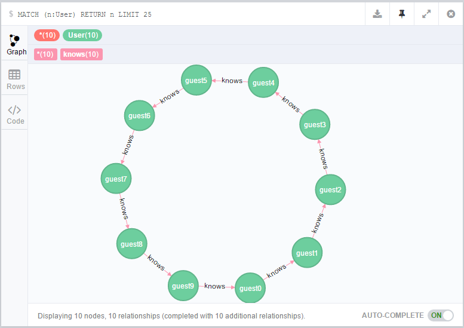

Neo4j Java NativeAPI Demo
---
[tutorials-java-embedded](http://neo4j.com/docs/stable/tutorials-java-embedded.html)

* dao
use native api to operate graph crud.  
[-]  use AOP to handle transaction  
[-]  remote spring onfig

* neo4j.db.embed.cfg.xml
``` xml
<?xml version="1.0" encoding="UTF-8"?>
<beans xmlns="http://www.springframework.org/schema/beans"
	xmlns:xsi="http://www.w3.org/2001/XMLSchema-instance" xmlns:util="http://www.springframework.org/schema/util"

	xsi:schemaLocation="http://www.springframework.org/schema/beans http://www.springframework.org/schema/beans/spring-beans-3.0.xsd
  http://www.springframework.org/schema/util http://www.springframework.org/schema/util/spring-util-2.0.xsd">
	<description> neo4j embedded db config</description>

	<util:map id="config">
		<entry key="enable_remote_shell" value="true" />
	</util:map>

	<bean id="graphDbFactory" class="org.neo4j.graphdb.factory.GraphDatabaseFactory" />

	<bean id="graphDbBuilder" factory-bean="graphDbFactory"
		factory-method="newEmbeddedDatabaseBuilder">
		<constructor-arg value="F://Dev//neo4j//data//graph.db" />
	</bean>

	<bean id="graphDbBuilderFinal" factory-bean="graphDbBuilder"
		factory-method="setConfig">
		<constructor-arg ref="config" />
	</bean>

	<bean id="graphDatabaseService" factory-bean="graphDbBuilderFinal"
		factory-method="newGraphDatabase" destroy-method="shutdown" />
</beans>
``` 

* user model screenshoot
   
