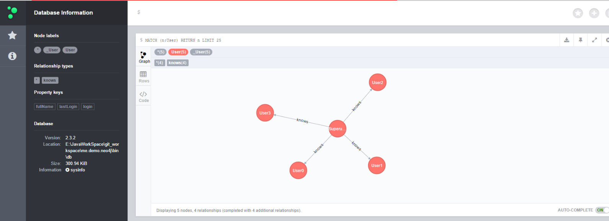

SpringData for Neo4j Demo
---
[Spring Data Neo4j参考文档](http://www.javabeat.net/spring-data-neo4j/)

* User Domain Mapping TO Graph
```java
@NodeEntity
public class User {

  @GraphId
  Long id;

  @Indexed
  private String login;

  private String fullName;

  private Date lastLogin;

  @RelatedTo(type = "knows", direction = Direction.OUTGOING)
  Set<User> friends;

  public void knows(User user) {
	friends.add(user);
  }
}
```

* UserDao
```java
public interface UserDao extends GraphRepository<User> {
  @Query("MATCH root-[:knows]->friends RETURN friends")
  List<User> findFriendsOfRoot();
}
```

* neo4j.embed.cfg.xml
``` xml
<?xml version="1.0" encoding="UTF-8"?>
<beans xmlns="http://www.springframework.org/schema/beans"
	xmlns:context="http://www.springframework.org/schema/context"
	xmlns:xsi="http://www.w3.org/2001/XMLSchema-instance" xmlns:neo4j="http://www.springframework.org/schema/data/neo4j"
	xmlns:tx="http://www.springframework.org/schema/tx"
	xsi:schemaLocation="
       	http://www.springframework.org/schema/beans
       	http://www.springframework.org/schema/beans/spring-beans.xsd
		http://www.springframework.org/schema/context
		http://www.springframework.org/schema/context/spring-context.xsd
		http://www.springframework.org/schema/data/neo4j
		http://www.springframework.org/schema/data/neo4j/spring-neo4j.xsd
		http://www.springframework.org/schema/tx
		http://www.springframework.org/schema/tx/spring-tx.xsd">
	<description>embeded neo4j config</description>
	<context:component-scan base-package="me.demo.neo4j"></context:component-scan>
	<!-- Embeded Neo4j -->
	<neo4j:config storeDirectory="bin/db" base-package="me.demo.neo4j.entity" />
	<!-- Package w/ automagic repositories -->
	<neo4j:repositories base-package="me.demo.neo4j.dao" />
	<context:annotation-config />  
</beans>
```


